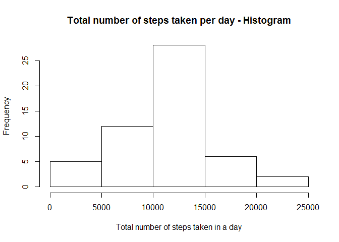
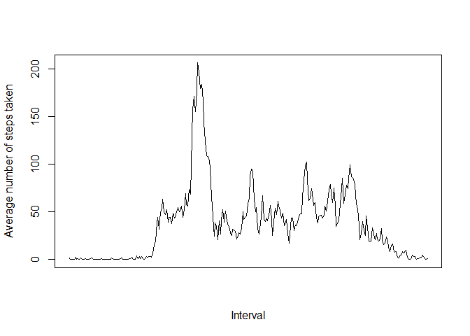
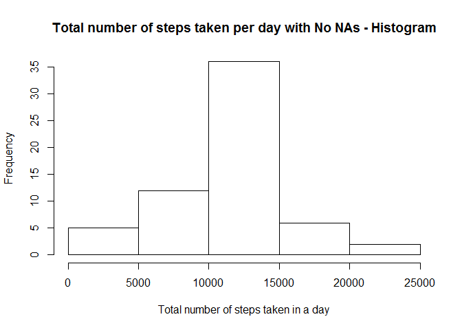
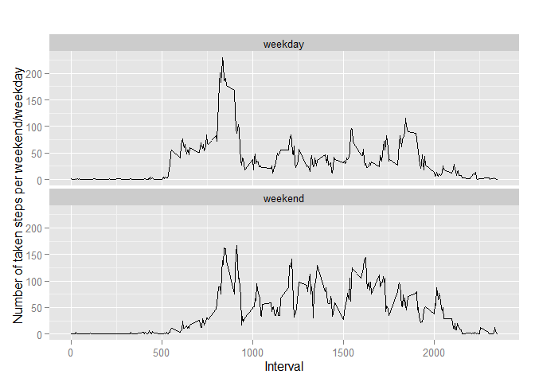

# Reproducible Research: Peer Assessment 1


## Loading and preprocessing the data

1.Let's loar the data using read.csv:

```r
#Setting working directory
setwd("C:/Users/Florent/Desktop/MOOC/ReproducibleResearch")
#Reading Data
activity <- read.csv("activity.csv")
```

2.Now load dplyr and process the data into a tabular data frame for the analysis:

```r
#Loading useful library and process data
library(dplyr)
```

```
## 
## Attaching package: 'dplyr'
```

```
## The following objects are masked from 'package:stats':
## 
##     filter, lag
```

```
## The following objects are masked from 'package:base':
## 
##     intersect, setdiff, setequal, union
```

```r
activityTable<- tbl_df(activity)
```


## What is mean total number of steps taken per day?

1. Let's group and summarize the data by date, to calculate the total number of steps taken per day:

```r
activityGrouped <-group_by(activityTable, date)
stepsPerDay <-summarize(activityGrouped, totalSteps=sum(steps))
```

```r
print(stepsPerDay)
```

```
## Source: local data frame [61 x 2]
## 
##          date totalSteps
##        (fctr)      (int)
## 1  2012-10-01         NA
## 2  2012-10-02        126
## 3  2012-10-03      11352
## 4  2012-10-04      12116
## 5  2012-10-05      13294
## 6  2012-10-06      15420
## 7  2012-10-07      11015
## 8  2012-10-08         NA
## 9  2012-10-09      12811
## 10 2012-10-10       9900
## ..        ...        ...
```

2. We can now make a histogram of the total number of steps taken each day:

```r
hist(stepsPerDay$totalSteps, main="Total number of steps taken per day - Histogram", 
     xlab="Total number of steps taken in a day")
```

\

3. Calculation of the mean and median of the total number of steps taken per day:

```r
meanSteps<-mean(stepsPerDay$totalSteps, na.rm=TRUE)
medianSteps<-median(stepsPerDay$totalSteps, na.rm=TRUE)
```
**The mean number of steps taken per day is:**

```r
print(meanSteps)
```

```
## [1] 10766.19
```
**The median number of steps taken per day is:**

```r
print(medianSteps)
```

```
## [1] 10765
```


## What is the average daily activity pattern?

1. Let's make a time series plot of the 5-minute interval and the average number of steps taken, averaged across all days (y-axis) through two steps:

a. Let's first create a new data frame, that includes the average number of steps taken per interval:

```r
stepsInterval <- aggregate(steps ~ interval, activity, mean)
```

b. And create the plot out of this data frame:

```r
plot(stepsInterval$steps, xlab="Interval", ylab="Average number of steps taken", xaxt = "n", type="l")
```

\

2. To find the 5-minute interval, on average across all the days in the dataset, that contains the maximum number of steps:

a. Let's find the row of the data frame, where the maximum number of steps taken is reached:

```r
maximumStepsRow <- which.max(stepsInterval$steps)
```

b. And deduct the corresponding interval value:

```r
stepsInterval[maximumStepsRow,]
```

```
##     interval    steps
## 104      835 206.1698
```
**Interval 835 has the maximum number of steps**


## Imputing missing values

1. We can calculate and report the total number of missing values in the dataset (i.e. the total number of rows with NAs), by comparing the "activity" data frame to its complete cases version:

```r
missing<-nrow(activity) - nrow( filter(activity, complete.cases(activity)))
print(missing)
```

```
## [1] 2304
```
**There are 2304 rows with missing values**

2. We will now **replace the missing values by the mean of the number of steps** taken for this day.

3. We can create a new dataset that is equal to the original dataset but with the missing data filled in.
We will call the new data frame named "activityNoNa" and use a for loop to replace missing values, using the average of steps taken per day calculated in data frame "stepsInterval", computed above.

```r
activityNoNa <- activity

for (i in 1:nrow(activityNoNa)) {
  if (is.na(activityNoNa$steps[i])) {
    interval <- activityNoNa$interval[i]
    steps <- stepsInterval[stepsInterval$interval == interval,]
    activityNoNa$steps[i] <- steps$steps
  }
}
```

The new data frame doesn't contain NAs, replaced with the mean of steps taken for this day:

```r
head(activityNoNa)
```

```
##       steps       date interval
## 1 1.7169811 2012-10-01        0
## 2 0.3396226 2012-10-01        5
## 3 0.1320755 2012-10-01       10
## 4 0.1509434 2012-10-01       15
## 5 0.0754717 2012-10-01       20
## 6 2.0943396 2012-10-01       25
```

4. We will now make a histogram of the total number of steps taken each day and calculate and report the mean and median total number of steps taken per day.

Let's process the data to create the histogram:

```r
activityNoNaTable <- tbl_df(activityNoNa)
activityNoNaGrouped <-group_by(activityNoNaTable, date)
stepsPerDayNoNa <-summarize(activityNoNaGrouped, totalSteps=sum(steps))
```

```r
hist(stepsPerDayNoNa$totalSteps, main="Total number of steps taken per day with No NAs - Histogram", 
     xlab="Total number of steps taken in a day")
```

\

Let's now calculate the new mean and median, now that we have removed NAs:

```r
meanStepsNoNa<-mean(stepsPerDayNoNa$totalSteps)
medianStepsNoNa<-median(stepsPerDayNoNa$totalSteps)
```
**The mean number of steps taken per day is:**

```r
print(meanStepsNoNa)
```

```
## [1] 10766.19
```
**The median number of steps taken per day is:**

```r
print(medianStepsNoNa)
```

```
## [1] 10766.19
```
**Now that we have replaced missing values, We notice a change in the median value, but not in the mean value. It is logical that the mean doesn't change, as we have chosen to replace the missing values with the mean itself.**


## Are there differences in activity patterns between weekdays and weekends?

1. To compare weekdays and weekends, we will create a new factor variable in the dataset with two levels – “weekday” and “weekend” indicating whether a given date is a weekday or weekend day. Let's create this factor variable in two steps:

a. Add a variable named weekday, with the named day of the week in a new data frame: "activityNoNaWeekday".

```r
activityNoNaWeekday <- mutate(activityNoNa, weekday=weekdays(as.Date(activityNoNa$date)))
```

b. Turn "activityNoNaWeekday" into the new "activityNoNaWeekdayClean" by transforming the value of weekday into "weekday"/"weekend" when the name of the day is appropriate. (Local computer works in French, so names of the days are in French).

```r
activityNoNaWeekdayClean <- activityNoNaWeekday

for (i in 1:nrow(activityNoNaWeekdayClean)) {
  if ((activityNoNaWeekdayClean$weekday[i] == "samedi") | (activityNoNaWeekdayClean$weekday[i] == "dimanche")) 
    activityNoNaWeekdayClean$weekday[i] = "weekend" else activityNoNaWeekdayClean$weekday[i] = "weekday"
}
```

```r
head(activityNoNaWeekdayClean)
```

```
##       steps       date interval weekday
## 1 1.7169811 2012-10-01        0 weekday
## 2 0.3396226 2012-10-01        5 weekday
## 3 0.1320755 2012-10-01       10 weekday
## 4 0.1509434 2012-10-01       15 weekday
## 5 0.0754717 2012-10-01       20 weekday
## 6 2.0943396 2012-10-01       25 weekday
```

2. To finish, let's make a panel plot containing a time series plot of the 5-minute interval and the average number of steps taken, averaged across all weekday days or weekend days.

First, we have to process "activityNoNaWeekdayClean" and aggregate it by interval and weekday:

```r
stepsIntervalNoNa <- aggregate(steps ~ interval+weekday, activityNoNaWeekdayClean, mean)
```

Now create the plot comparing steps taken in weekends to weekdays using ggplot2:

```r
library(ggplot2)
```


```r
qplot(interval, 
      steps, 
      data = stepsIntervalNoNa, 
      type = "l", 
      geom=c("line"),
      xlab = "Interval", 
      ylab = "Number of taken steps per weekend/weekday", 
      main = "")  + facet_wrap(~ weekday, ncol = 1)
```

\
